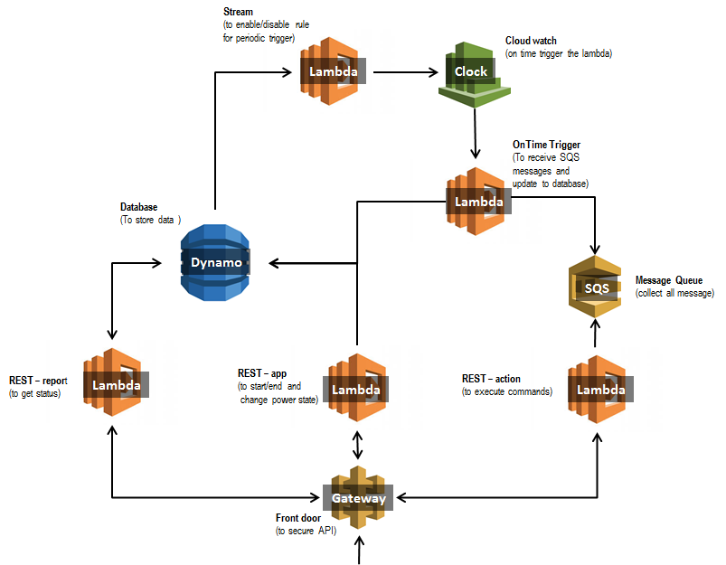

# Robot simulation

Performed robot movement in the board size and not fall off from the table.

#
###### Getting Started
install all dependencies
```sh
npm install
```

#
###### Setup
To deploy to the AWS by using serverless framework, you need to have an access 'aws_access_key_id' and 'aws_secret_access_key'.
So, you need to create AWS account and change the profile **robotsimulate** in serverless.yml
-eg: file in "C:/Users/xxx/aws/credentials"
```sh 
[robotsimulate]
aws_access_key_id = XXXXXXX...
aws_secret_access_key = XXXXXXX...
```

#
###### Deployment
Deploy all the services (eg: gateway, lambda, cloudwatch, sqs, dynamodb) into AWS
```sh
serverless deploy
```
Before do the "serverless deploy", there are two manual actions to fully deploy all the services. (due to serverless problem)
> DynamoDB event stream issue
> 1) clear the input in of DynamoDB event stream in serverless.yml file (streamFunction->events->stream) then run "serverless deploy"
> 2) manual enable the stream in AWS console (in the overview of DynamoDB, select the manage stream and choose "new and old images" type)
> 3) then copy the latest stream ARN into serverless.yml (eg: arn:aws:dynamodb:ap-southeast-1:xxxxxxxx:table/robot-dev/stream/2018-03-29T08:46:38.993)
> 4) "serverless deploy" again to enable the DynamoDB event stream
 
> Get account id for SQS issue (temporary cannot get by coding)
> 1) get the account id from AWS console and replace the account id in sqsTaskManager.js file (eg: 288329xxxxxx)
> 2) then "serverless deploy" again to fully enable all the services

#
###### Architecture Diagram


#
###### REST API
API for controlling the robot simulation
Refer to the [REST.md](REST.md) file for details

#
###### Test & Coverage
To run test and generate code coverage report 
```sh
npm run test  
```
> coverage folder is created, open coverage/index.html to view the report

#
###### End-user Test
Using postman to test for API calls.
Find the collection and run test in "end_user_test" folder.

#
######This application is tested on node=v6.10.3